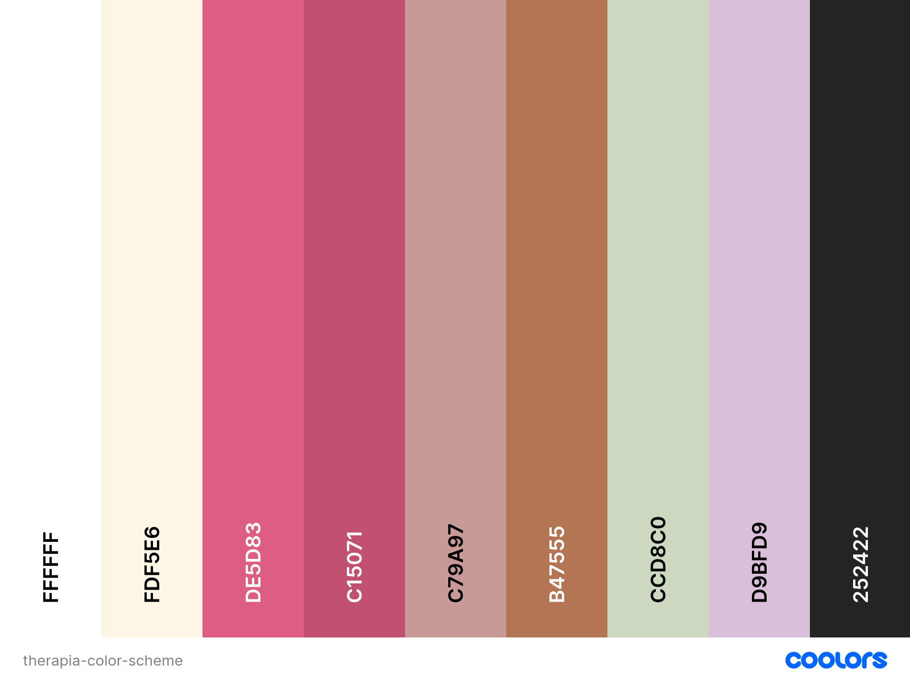

# Milestone Project 1: Therapia Counselling Service 

## Contents

1. Introduction
2. User Stories
3. User Experience
4. Features
5. Technologies Used
6. Deployment
7. Getting Started
8. Credits
9. Acknowledgements

## Introduction

This website was created for Milestone Project 1 of the Code Institute course, Level 5 Diploma in Web Application Development.

The website is a reimagined version of my therapist's website for her counselling service, [Therapia Counselling Service](https://www.therapiacounsellingservice.com/) (created with her permission).

### Purpose

Therapia Counselling Service is an online therapy service for individuals seeking a safe space to be vulnerable and talk through their mental health challenges and issues surrounding their lives.

The site can be accessed via this [link](...).

## User Stories

### User Goals

#### First Time User

#### Returning User

### Business Goals

## User Experience (UX)

### Color Scheme

The color scheme was chosen to be calming and inviting for prospective clients.

- **#FFFFFF:**
- **#FDF5E6:**
- **#DE5D83:** Blush pink color to stand out against the rest of the color scheme so that users could easily see the        back-to-top button.
- **##C15071:** Darker pink color
- **#C79A97:**
- **#B47555:**
- **#CCD8C0 'Biege':** pastel green color
- **#D9BFD9 'Thistle':** lilac color used for
- **#252422 'Eerie Black':** black color used for the overall text of the website.

### Typography

### Wireframes

#### Mobile Phone

#### Tablet

#### Laptop/Desktop

## Features

### Universal

#### Navigation Bar

#### Footer

### Home Page

#### Hero Section

#### Call to Action

#### About Section

#### 'What I Can Help With' Section

#### Testimonials Section

### Services Page

### Contact Page

## Technologies Used

### Languages

1. HTML

2. CSS
- CSS Flexbox
- CSS Grid

3. JavaScript: required for Font Awesome to be embedded into the HTML document.

## Deployment

### Deployment to GitHub Pages

### Local Deployment

## Credits

- Julia (mentor): advise for general README.md structure;
- [Educative.io](https://www.educative.io/answers/how-to-change-image-size-in-markdown): referred to when figuring out how to resize images in Markdown;
- [Therapia Counselling Service](https://www.therapiacounsellingservice.com/): For the general content.

### General CSS
- [Stack Overflow](https://stackoverflow.com/);
- MDN Web Docs: [HTML](https://developer.mozilla.org/en-US/docs/Web/HTML) and [CSS](https://developer.mozilla.org/en-US/docs/Web/CSS).

### Media

- Home:
    + [Hero image](https://www.clinical-partners.co.uk/images/therapies/talking-therapies-hero.jpg): 
        Clinical Partners Talk Therapy [website](https://www.clinical-partners.co.uk/for-adults/talking-therapy);
    + [Footer image](https://unsplash.com/photos/white-petaled-flowers-in-focus-photography-XKD2xQ7fbKc);
    + Benefits section images:
        -  Healthy Boundaries: 
            [website](https://studybreaks.com/thoughts/importance-of-setting-boundaries/?utm_content=cmp-true), Valentina Palomino; 
            [image](assets/images/home/boundaries-image.jpg).
        - Self-confidence: 
            [website](https://pixabay.com/illustrations/self-love-self-confidence-woman-7200173/), Geralt; 
            [image](assets/images/home/self-confidence-image.jpg).
        - Self-awareness: 
            [website](https://stock.adobe.com/search?k=self+awareness), Vector Mine; 
            [image](assets/images/home/self-awareness-image.jpg).
        - Relationships: 
            [website](hhttps://healthmaintaintips.com/healthy-vs-unhealthy-relationships/), Royalx; 
            [image](assets/images/home/relationships-image.jpg).
        - Communication Skills: 
            [website](https://heartfulness.org/magazine/listening-with-the-intent-to-understand), Liz Kingsnorth; 
            [image](assets/images/home/communication-image.jpg).
        - Coping Skills: 
            [website](https://safety4sea.com/cm-dealing-with-stress-how-active-coping-can-help/), Shuttershock; 
            [image](assets/images/home/coping-skills-image.jpg).

- Services:
    + 
    + 

### Design Tools

- [Canva](https://www.canva.com/en_gb/): used to create the logo.
- [Coolors](https://coolors.co/): used to create the color scheme for the website.
- [Miro](https://miro.com/?gclsrc=aw.ds&utm_source=google&utm_medium=cpc&utm_campaign=S%7CGOO%7CBRN%7CUK%7CEN-EN%7CBrand%7CExact&utm_adgroup=&adgroupid=140324298625&utm_custom=18258206159&utm_content=668037264203&utm_term=miro&matchtype=e&device=c&location=1006848&gad_source=1&gclid=Cj0KCQjw3bm3BhDJARIsAKnHoVVmpdQ7at_R87EX2sjRF_OHaKYHl9g__zcQkENB1TRvSRukEze4CjQaAno4EALw_wcB): used to design the wireframes for the Therapia Couselling Service website.
- [Font Awesome](https://fontawesome.com/icons): used for icons across the website.
- [Box Shadow](https://box-shadow.dev/): used to generate the code used for the box shadows based on the desired adjustments.
- [Rapid Tables](https://www.rapidtables.com/convert/color/hex-to-rgb.html?hex=c79a97): used to translate HEX codes to RGB for the font, background and box shadow colors.

### Tutorials
- [Snap Tutorials](https://www.youtube.com/watch?v=WsF9_2h4K34): advice on how to use flex box for a navbar.
- [Tyler Potts YouTube Channel](https://www.youtube.com/watch?v=fYGe-SuFAHU): used for "back-to-top" button.

## Acknowledgements

- Julia (mentor): README.md layout
- [Natalie Atandare](...): Thank you to my therapist for giving me a safe space to grow - mentally and professionally.

