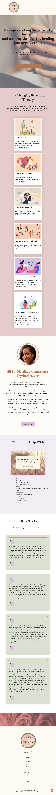

# Milestone Project 1: Therapia Counselling Service

## Contents

1. Introduction
2. User Stories
3. User Experience
4. Features
5. Technologies Used
6. Deployment
7. Credits
8. Acknowledgements

## Introduction

This website was created for Milestone Project 1 of the Code Institute course, Level 5 Diploma in Web Application Development.

The website is a reimagined version of my therapist's website for her counselling service, [Therapia Counselling Service](https://www.therapiacounsellingservice.com/), and was created with her permission.

### Purpose

Therapia Counselling Service is an online therapy service for individuals seeking a safe space to be vulnerable and talk through their mental health challenges and issues surrounding their lives.

The deployed site can be accessed via this [link here](https://t-shanacodeth.github.io/therapia-counselling-service-MP1/).

---

## User Stories

### User Goals

#### First Time User

- As a first time user, I want to be able to clearly know what the website is about.
- As a first time user, I want to be able to find out more about the therapist and the services that they offer.
- As a first time user, I want to easily find where the therapist can be contacted should I need their service.

#### Returning User

- As a returning user, I want to easily submit a form to the therapist for their services and know that they have received it, and the timeframe of receiving a response.
- As a returning user, I want to be able to connect with the therapist via their social media by navigating through their website.

### Business Goals

- As the owner of Therapia Counselling Service, I want to portray my personality and the feel of a 'safe space' to potential clients.
- As the owner of Therapia Counselling Service, I want let potential clients know a bit about who I am, my therapy experience and my services whilst making it personal and personable.
- As the owner of Therapia Counselling Service, I want potential clients to be able to contact me to book a consultation or genral enquiries.

---

## Features

### Universal

#### Navigation Bar

Positioned at the top of the page, containing: the company logo on the left side, and the navigation links on the right.
It is clear and easy to understand.

The navigation links are:

- HOME - leads the user to the home page where they can learn about the company, Therapia COunselling Service, and its owner. As well as the benefits of therapy.
- SERVICES - leads the user to the 'Services' page where they can find out about the services offered.
- CONTACT - leads to the 'Contact' page where users can get in touch with the owner of the company for use of the services provided by filling out the form.

The navigation links have a hover effect so that the users know they are interactive and can be clicked.

The navigation bar is responsive, and the view is the same for tablets and mobiles for ease.
A hamburger menu has been implemented, and when clicked a sidebar opens which reveals the navigation links for users.

The sidebar takes up the entire height of the device.

#### Footer

The footer is positioned at the bottom of each page.
Each footer is different in that they each have a different banner image to match the main colors of the page. It creates a better flow.

The general styling for all footers include:

- COMPANY LOGO: positioned to the left of the footer with copyright infromation.
- MENU section: position to the center of the footer. Each menu link direct the users to the pages of the webiste - the same as the navigation links in the navigation bar at the top.
- SOCIAL MEDIA section: positioned to the right of the footer. They take the user to the company's social media pages to further connect.

Like the navigation bar, it is also responsive. When viewed on devices smaller than a tablet, the footer will collapse into a coloumn.

---

### Home Page

The Home page represents the main idea of the company.

The Home page is also responsive for tablets and phones.
For the responsivity of each section, pleaser refer to the images below:

**Tablets**

**Phones**

---

#### Hero Section

The Hero section is a fixed background of an image. It also includes a call to action for users to interact with.

---

#### 'Life Changing Benefits of Therapy' Section

This section concisely explains to users some of the many benefits of therapy.
It consists of six cards with images which compliment the color of the section, and reasons why that card title is a benefit underneath.

---

#### About Section

This section introduces the company, Therapia COunselling Service, and its owner, Natalie Atandare.
On the left is an image, and on the right is a summary of what her experience is and what her goals are the the service.

---

#### 'What I Can Help With' Section

This section clerly and concisely identifies what Natalie can help potential clients with.
However, this only covers some of her extensive experience.

To the right (or above depending on the device) of the unordered list of types of issues that Natalie is worked with, is one of her favortie quotes, with hopes that it will motivate potential users to not give up on life.

---

#### Testimonials Section

The testimonials section called 'Client Stories' has four cards with feeback from former clients who were happy with Natalie's service.
Due to the personal nature of therapy, the author of each feedback has been left anonymous.

---

### Services Page

The Services page includes a summary of what the type of therapy provided is, the modialities used to promote change in a person, and to expect in the sessions.

At the bottom of the page is a Call to Action button, which leads the potential client to the Contact page, should they wish to use the service after liking what they read.

---

### Contact Page

The Contact page includes a motivational quote at the top, and a form.
In the form the potential client could enter their details if they would like to get in contact with Natalie and book a free consultation, or find out more general information.

When the website user clicks the 'Submit' button, it would lead them to the 'Response' page.

The contact form is also responsive for tablets and phones. Please see the image below.

---

### Response Page

The Response page includes a short message thanking the website user for filling out the form to get in contact with Natalie, and gives them an expected timeframe for which she will be in contact for the first part of the service or to answer the general query.

---

## User Experience (UX)

### Color Scheme

The color scheme was chosen to be calming and inviting for prospective clients. It was intended to feel welcomning.

- **#FFFFFF:** White was used so that the cream color was not overused.
- **#FDF5E6:** Cream color was used as the main color of the website. This was the fist color selected. I wanted to create a calming and homey feel to the website. The other colors were selected to compliment this color and theme.
- **#DE5D83:** Blush pink color to stand out against the rest of the color scheme so that users could easily see the back-to-top button and the hover action in the footer.
- **##C15071:** Darker pink color used for hover effect over the back-to-top button for clear interaction.
- **#C79A97:** Dusty pink color used as a complimentary color. It was used for some of the sections such as the 'Life Changing Benefits of Therapy' and the 'Response' page.
- **#B47555:** Brown color was used to provide a contrast with the main cream color of the website. It was assigned to the buttons and the heading of the About section.
- **#CCD8C0:** Pastel green color used for sections of the website - the client stories testimonial boxes and the background of the 'Services' page.
- **#D9BFD9:** Lilac color used for used for sections of the website as it is my therapist's favorite color. I wanted to incoporate more of the colors that she liked or I felt matched her vibe/energy so that the website could best represent her.
- **#252422:** Black color used for the overall text of the website for good contrast between the background and the text.

### Typography

The fonts used were taken from [Google Fonts](https://fonts.google.com/).

- Abril Fatface was used for the h1 tags on each page. It was used to attract the users' attention.

- Montserrat was used as the main font for the website to provide a contrast with the fancy serif fonts used for the headings and quotes. It increaded the readabilty of the content for the users.

- EB Garamond was used as the font for the subheadings on the home page and the names of the quotes authors.

- Playfair was used in the quotes to differentiate between the general contact of the website and the authors of the quotes.

### Wireframes

#### Mobile Phone

- [Home](documentation/wireframes/Therapia-home-mobile-wireframe.jpg)
- [Services](documentation/wireframes/Therapia-services-mobile-wireframe.jpg)
- [Contact](documentation/wireframes/Therapia-contact-mobile-wireframe.jpg)

#### Tablet

- [Home](documentation/wireframes/Therapia-home-tablet-wireframe.jpg)
- [Services](documentation/wireframes/Therapia-services-tablet-wireframe.jpg)
- [Contact](documentation/wireframes/Therapia-contact-tablet-wireframe.jpg)

#### Desktop

- [Home](documentation/wireframes/Therapia-home-desktop-wireframe.jpg)
- [Services](documentation/wireframes/Therapia-services-desktop-wireframe.jpg)
- [Contact](documentation/wireframes/Therapia-contact-desktop-wireframe.jpg)

---

## Technologies Used

### Languages

1. HTML: used for the sturcture and content of the website,

2. CSS : used for the styling of the website,

- CSS Flexbox: used for the general layout of the pages, and their responsivity;,

3. JavaScript: required for Font Awesome, and Bootstrap to be embedded into the HTML document,

4. Bootstrap: used for the navigation - the hamburger menu and the repsponsivity on different device sizes.

### Programs

1. Gitpod with integrated VSCode: the development environment used to write and edit code,

2. Google Chrome: the browser of choice,

3. Git (version control),

4. GitHub: used to host and showcase my project,

5. Git Pages: to deploy the website.

### Design Tools

- [Canva](https://www.canva.com/en_gb/): used to create the logo.
- [Coolors](https://coolors.co/): used to create the color scheme for the website.
- [Miro](https://miro.com/?gclsrc=aw.ds&utm_source=google&utm_medium=cpc&utm_campaign=S%7CGOO%7CBRN%7CUK%7CEN-EN%7CBrand%7CExact&utm_adgroup=&adgroupid=140324298625&utm_custom=18258206159&utm_content=668037264203&utm_term=miro&matchtype=e&device=c&location=1006848&gad_source=1&gclid=Cj0KCQjw3bm3BhDJARIsAKnHoVVmpdQ7at_R87EX2sjRF_OHaKYHl9g__zcQkENB1TRvSRukEze4CjQaAno4EALw_wcB): used to design the wireframes for the Therapia Couselling Service website.
- [Font Awesome](https://fontawesome.com/icons): used for icons across the website.
- [Box Shadow](https://box-shadow.dev/): used to generate the code used for the box shadows based on the desired adjustments.
- [Rapid Tables](https://www.rapidtables.com/convert/color/hex-to-rgb.html?hex=c79a97): used to translate HEX codes to RGB for the font, background and box shadow colors.

---

## Testing

Please refer to the [TESTING.md](TESTING.md) file for all test-related documentation.

---

## Deployment

### Deployment to GitHub Pages

The site was deployed to GitHub Pages. The steps to deploy are as follows:

1. In the [GitHub repository](https://github.com/t-shanacodeth/therapia-counselling-service-MP1), navigate to the Settings tab.
2. In Settings, click on Pages in the side menu on the left. The new page should load to say "GitHub Pages".
3. From the source section drop-down menu, select the **Main** Branch, then click "Save".
4. The page will be automatically refreshed with a detailed ribbon display to indicate the successful deployment.

The live link can be found [here](https://t-shanacodeth.github.io/therapia-counselling-service-MP1/).

### Local Deployment

In order to make a local copy of this project, you can clone it.
In your IDE Terminal, type the following command to clone my repository:

`git clone https://github.com/t-shanacodeth/therapia-counselling-service-MP1.git`

Alternatively, if you use Gitpod, you can [click here](https://gitpod.io/#https://github.com/t-shanacodeth/therapia-counselling-service-MP1), which will start the Gitpod workspace for you.

---

## Credits

- [Educative.io](https://www.educative.io/answers/how-to-change-image-size-in-markdown): referred to when figuring out how to resize images in Markdown;
- [Therapia Counselling Service](https://www.therapiacounsellingservice.com/): For the general content.

### General CSS

- [Stack Overflow](https://stackoverflow.com/).
- MDN Web Docs: [HTML](https://developer.mozilla.org/en-US/docs/Web/HTML) and [CSS](https://developer.mozilla.org/en-US/docs/Web/CSS).
- [W3Schools](https://www.w3schools.com/): for general HTML and CSS guidance.
- [CSS Tricks](https://css-tricks.com/snippets/css/a-guide-to-flexbox/): for a how-to on CSS flexbox.

### Media

- Home:

  - [Hero image](https://www.clinical-partners.co.uk/images/therapies/talking-therapies-hero.jpg):
    Clinical Partners Talk Therapy [website](https://www.clinical-partners.co.uk/for-adults/talking-therapy).
  - [Footer image](https://unsplash.com/photos/white-petaled-flowers-in-focus-photography-XKD2xQ7fbKc).
  - Benefits section images:
    - Healthy Boundaries:
      [website](https://studybreaks.com/thoughts/importance-of-setting-boundaries/?utm_content=cmp-true), Valentina Palomino,
      [image](assets/images/home/boundaries-image.jpg).
    - Self-confidence:
      [website](https://pixabay.com/illustrations/self-love-self-confidence-woman-7200173/), Geralt,
      [image](assets/images/home/self-confidence-image.jpg).
    - Self-awareness:
      [website](https://stock.adobe.com/search?k=self+awareness), Vector Mine,
      [image](assets/images/home/self-awareness-image.jpg).
    - Relationships:
      [website](hhttps://healthmaintaintips.com/healthy-vs-unhealthy-relationships/), Royalx,
      [image](assets/images/home/relationships-image.jpg).
    - Communication Skills:
      [website](https://heartfulness.org/magazine/listening-with-the-intent-to-understand), Liz Kingsnorth,
      [image](assets/images/home/communication-image.jpg).
    - Coping Skills:
      [website](https://safety4sea.com/cm-dealing-with-stress-how-active-coping-can-help/), Shuttershock,
      [image](assets/images/home/coping-skills-image.jpg).
  - About [image](assets/images/home/natalie-atandare.webp): Natalie Atandare.

- Services:

  - [Footer image](https://www.pexels.com/photo/white-cherry-blossom-flowers-2744616/), William Jesús Casique Toro, [image](assets/images/services/service-footer-img-2.jpg).

- Response:
  - [Footer image](https://www.pexels.com/photo/pink-flowers-photography-1128797/): Nathan Cowley, [image](assets/images/response/response-footer.jpg).

### Tutorials

- [Snap Tutorials](https://www.youtube.com/watch?v=WsF9_2h4K34): advice on how to use flex box for a navbar.
- [Tyler Potts YouTube Channel](https://www.youtube.com/watch?v=fYGe-SuFAHU): used for "back-to-top" button.
- [CodingLab Youtube Channel](https://www.youtube.com/watch?v=eUMqJMkwOBY): used for tips on how to make a responsive contact form.

## Acknowledgements

- [Julia](https://github.com/IuliiaKonovalova): Thank you Julia for being a great mentor and just telling me how it is without any coddling. I definitely wouldn't have been as successful in thei project if it weren't for you!
- [Natalie Atandare](https://www.therapiacounsellingservice.com/): Thank you to my therapist for giving me a safe space to grow - mentally and professionally.
