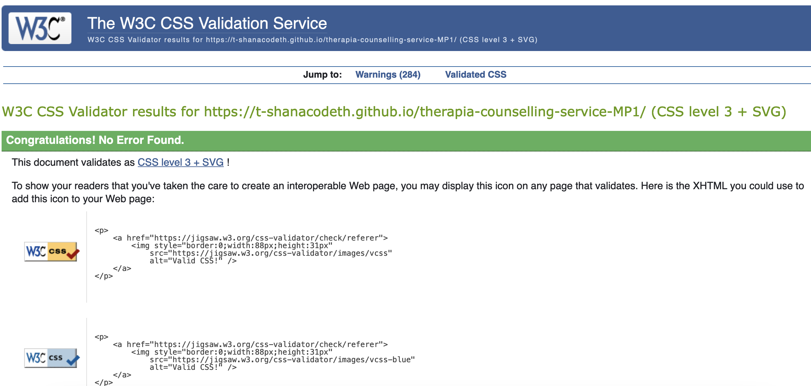
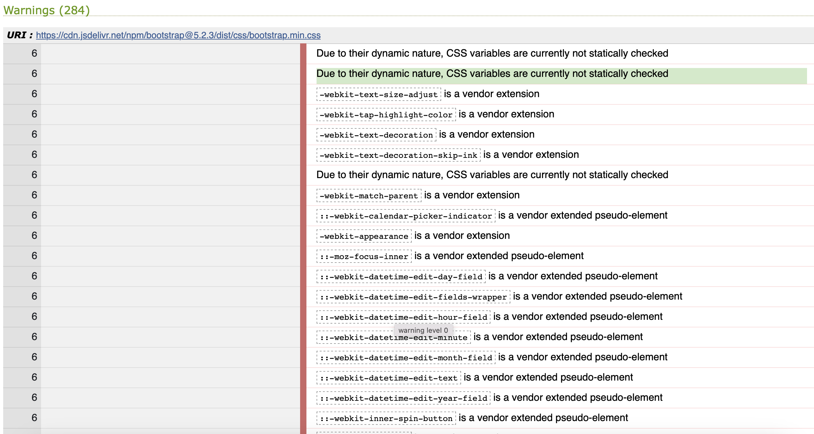

# Therapia Counselling Service

## TESTING

---

### Compatibility

---

To confirm the correct functionality, responsivity and overall appearance of the webiste, it was tested on the following browsers:

**Chrome**

 (click to view video)

**Firefox**

 (click to view video)

**Safari**

 (click to view video)

---

### Responsivity

---

The responsivity was tested using a Chrome extension called ['Responsive Viewer'](https://responsiveviewer.org/).

The devices that it the website uses are:

- iPhone 14 Pro - 393 x 852
- Google Pixel 7 Pro 480 x 1040
- iPhone 14 Pro Max 430 x 932
- iPad Air 5 820 x 1180
- Macbook Air 1559 x 975

 (click to view video)

Dev Tools of Google Chrome was also used to inspect the responsivity.

Some of the devices used by the 'Inspect' tool are:

- iPhone SE
- iPhone XR
- Samsung Galaxy S8+
- iPad Mini
- iPad Pro
- Google Nest Hub
- Google Nest Hub Max

## The responsivity test on these devices were also successful.

### Validator Testing

---

#### HTML

**Home**

- 4 errors were found on the Home page.
- No warnings were found.

**Services**

- 3 errors were found on the Services page.
- No warnings were found.

**Contact**

- 4 errors were found on the Contaact page.
- 2 warnings were found.

**Response**

- 2 errors were found on the Response page.

#### CSS

---

CSS was validated using [W3C CSS Validator](https://jigsaw.w3.org/css-validator/validator.html.en#validate_by_input) and [Stylelint](https://stylelint.io/demo/).

When the CSS was validated through W3C, by uploading the link of the deployed site:

- No errors found.
- 100+ warnings found.

Most of the warnings appear to be due to the Bootstrap CDN's :root variables, and their dynamic nature.

However, the same code was copied and pasted into the same validator:

- No errors found.
- No warnings found.

When the CSS was validated in Stylelint by copying and pasting the code into the text field:

- Over 100 errors were found. Many were repeated incorrect syntaxes.
- No warnings found.

#### Fix errors

---

**HTML**

- I was able to fix the button errors in the header, hero section and the About sestion.
- I was able to fix the arialabelledby issue after renaming to the id of the button that it is for.

0 HTML error remains across the whole site. Please see below:

**CSS**

Changes made to media queries screen width syntax:

Use of shorthand syntax for aligning and justifying items:

Addition of quotation marks to the input text string:

Wrapped the url addresses in quotation marks:

Condensed hero-text class into 1 CSS rule, rather than 2 rules at lines 44 and 218:

Removed quotation marks from a single-word font family and kept them around multiple-word font family as per the [W3C documentation](https://www.w3.org/TR/CSS2/fonts.html#font-family-prop):

Removed the redundant unit in shorthand syntaxes, and shortened then from 4 units to 3, for repeated measurements:

Removed the unit of measure when 0 was used:

Changed to modern color function notion for rgba:

Incorrect use of the comment syntax and a space was added before the comment's closing tags:

#### Post-fix Validation Results

After completing the recommended fixes by the Stylelint validator, below are the results from both Stylelint and the W3C CSS validators:

**W3C**

These are the results after running the code through W3C:

0 warnings.
0 errors.

These are the results after running the deployed site's URI through W3C:

284 warnings - which are, once again, due to the pre-written CSS code in the Bootstrap CDN URI used, which is necessary for some of the site's functionality.
0 errors.

**Stylelint**

These are the results after running the code through Stylelint:

0 warnings.
4 errors. They refer to specificity of different sections in the code which do not relate; for example the CSS rules for the i tag in the footer and the CSS rules for the i tag for the back to top button. Hence why I have not made any changes to this.

### LightHouse Report

---

With the use of Lighthouse in Dev Tools, I confirmed that the website is performing well, it is accessible and readable, but improvements could be made in the furture to improve these statistics.

#### HTML

**Home**

**Services**

**Contact**

**Response**

---

### Bugs

---

#### Solved bugs

1. The text and button in the hero section was pushing into the below section on mobile devices.
   _Solution_: I changed the height of the hero section for the background image to 52em, and the text container (.hero-text) to inherit the height of its parent container.

2. The logo and hamburger menu button in smaller screens were too close together.
   _Solution_: I reduced the size of the logo image from 150px to 125px height and width, reduced the padding on the left and right side of the header, and created another media query to account for screens with a max-width of 480px.

3. On smaller screen sizes, the alignment of the text underneath the quote image was skewed.
   _Solution_: I added a display setting of flex to the container and justified the content and aligned the items in the center.

4. On smaller screens, the alignmet of the forms buttons was not visually pleasing - they seemed skewed. 2. The logo and hamburger menu button in smaller screens were too close together.
   _Solution_: I changed that display of the buttons class to inline-flex and reduced the margin in the recently added media query that accounted for a max-width of 480px.

#### Unsolved bugs

1. The menu of the sidebar is not well aligned. They are too far to the right. I tried changing the margin as well as the display setting, but thoe did not work.

2. After fixing the button errors, the #contact-active id works in the Live Server, but not once deployed.

#### Mistakes

Many mistakes were made during committing messages.

- Some times I forgot what I wanted to commit and the changes that were made.
- The commit messages are inconsistent. I would like to learn a method of writing good commit messages and following through with it.
- To fix some of the error bugs, I have to use more !important in the CSS. For future improvement, I need to understand how to properly use buttons and a tags and the correct syntax.
