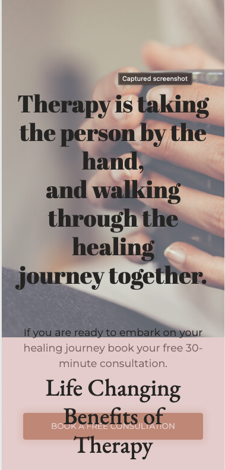
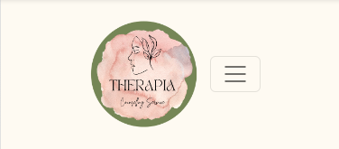

# Therapia Counselling Service
## TESTING

---

### Compatibility
---

To confirm the correct functionality, responsivity and overall appearance of the webiste, it was tested on the following browsers:

**Chrome**

 (click to view video)

**Firefox**

 (click to view video)

**Safari**

 (click to view video)

---

### Responsivity
---

The responsivity was tested using a Chrome extension called ['Responsive Viewer'](https://responsiveviewer.org/).

The devices that it the website uses are:
+ iPhone 14 Pro - 393 x 852
+ Google Pixel 7 Pro 480 x 1040
+ iPhone 14 Pro Max 430 x 932
+ iPad Air 5 820 x 1180
+ Macbook Air 1559 x 975

 (click to view video)

Dev Tools of Google Chrome was also used to inspect the responsivity.

Some of the devices used  by the 'Inspect' tool are:
+ iPhone SE
+ iPhone XR
+ Samsung Galaxy S8+
+ iPad Mini
+ iPad Pro
+ Google Nest Hub
+ Google Nest Hub Max

The responsivity test on these devices were also successful.
---

### Validator Testing
---

#### HTML

**Home**

+ 4 errors were found on the Home page.
+ No warnings were found.

**Services**

+ 3 errors were found on the Services page.
+ No warnings were found.

**Contact**

+ 4 errors were found on the Contaact page.
+ 2 warnings were found.

**Response**

+ 2 errors were found on the Response page.

#### CSS
---

+ No errors or warnings were found in the CSS.

#### Fix errors
---

+ I was able to fix the button errors in the header and the hero section, but not the About section.
+ I was able to fix the arialabelled by issue after renaming to the id of the button that it is for.

1 error bug remains across the whole website. Please see below:

### LightHouse Report
---

With the use of Lighthouse in Dev Tools, I confirmed that the website is performing well, it is accessible and readible, but improvements could be made in the furture to improve these statistics.

#### HTML

**Home**

**Services**

**Contact**

**Response**

---

### Bugs
---

#### Solved bugs

1. The text and button in the hero section was pushing into the below section on mobile devices.
    *Solution*: I changed the height of the hero section (for both the background image and the text container) to 55em.

    
    

2. The logo and hamburger menu button in smaller screens were too close together.
    *Solution*: I reduced the size of the logo image from 150px to 125px height and width, reduced the padding on the left and right side of the header, and created another media query to account for screens with a max-width of 480px.

    
    

3. On smaller screen sizes, the alignment of the text underneath the quote image was skewed.
    *Solution*: I added a display setting of flex to the container and justified the content and aligned the items in the center.

    
    

4. On smaller screens, the alignmet of the forms buttons was not visually pleasing - they seemed skewed.
    2. The logo and hamburger menu button in smaller screens were too close together.
    *Solution*: I changed that display of the buttons class to inline-flex and reduced the margin in the recently added media query that accounted for a max-width of 480px.

    
    

#### Unsolved bugs

1. The menu of the sidebar is not well aligned. They are too far to the right. I tried changing the margin as well as the display setting, but thoe did not work.

2. After fixing the button errors, the contact-active id works in the Live Server, but not once deployed.

#### Mistakes

Many mistakes were made during committing messages.
+ Some times I forgot what I wanted to commit and the changes that were made.
+ The commit messages are inconsistent. I would like to learn a method of writing good commit messages and following through with it.
+ To fix some of the error bugs, I have to use more !important in the CSS. For future improvement, I need to understand how to properly use buttons and a tags and the correct syntax.

